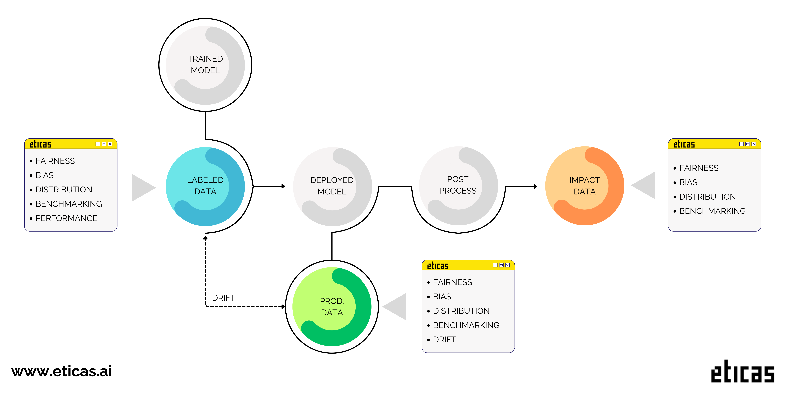

# Eticas: Bias & Audit Framework

<p align="center">
  
</p>


An open-source Python library designed for developers to calculate fairness metrics and assess bias in machine learning models. This library provides a comprehensive set of tools to ensure transparency, accountability, and ethical AI development.

## Why Use This Library?

AI System can inherit biases from data or amplify them during decision-making processes. This library helps ensure transparency and accountability by providing actionable insights to improve fairness in AI systems.

## Key Features

This framework is designed to audit AI systems comprehensively across all stages of their lifecycle. At its core, it focuses on comparing privileged and underprivileged groups, ensuring a fair evaluation of model behavior. Moreover, the library enables detailed analysis, providing insights into all groups present in the data.

With a wide range of metrics, this framework is a game-changer in bias monitoring. It offers a deep perspective on fairness, allowing for comprehensive reporting even without relying on true labels. The only restriction for measuring bias in production lies in performance metrics, as they are directly tied to true labels.



- **Demographic Benchmarking Monitoring**: Perform in-depth analysis of population distribution.
- **Model Fairness Monitoring**: Ensure equality and detect equity issues in decision-making.
- **Distribution Evaluation**: Analyze correlations, causality, and variable importance.
- **Performance Analysis**: Comprehensive tools to assess model performance, accuracy, and recall.
- **Model Drift Monitoring**: Detect and measure changes in data distributions and model behavior over time.


## Installation


1. Clone this repository.
2. In the root folder, run:

```bash
pip install .
```

## QuickStart


